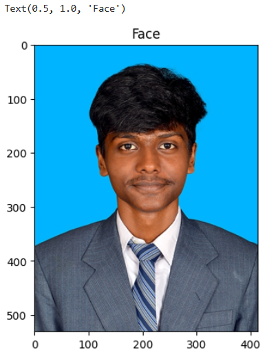
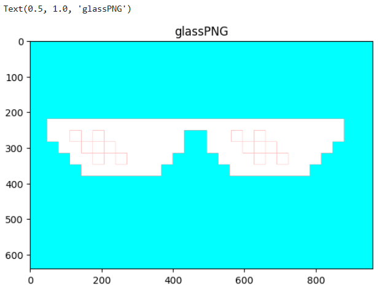
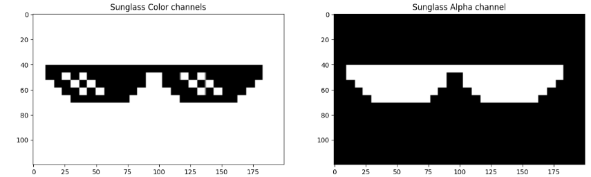
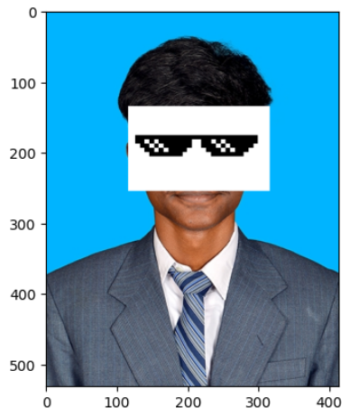
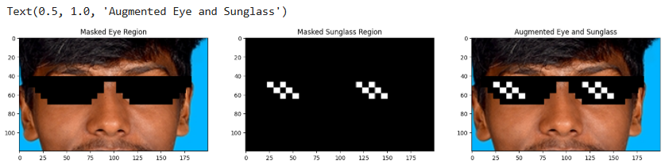
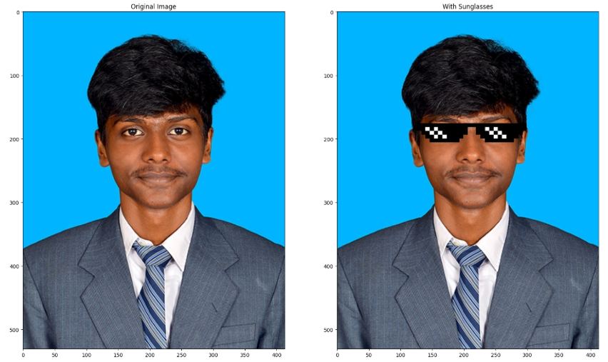

# Sturdy-Octo-Disco-Adding-Sunglasses-for-a-Cool-New-Look

Sturdy Octo Disco is a fun project that adds sunglasses to photos using image processing.

Welcome to Sturdy Octo Disco, a fun and creative project designed to overlay sunglasses on individual passport photos! This repository demonstrates how to use image processing techniques to create a playful transformation, making ordinary photos look extraordinary. Whether you're a beginner exploring computer vision or just looking for a quirky project to try, this is for you!

## Features:
- Detects the face in an image.
- Places a stylish sunglass overlay perfectly on the face.
- Works seamlessly with individual passport-size photos.
- Customizable for different sunglasses styles or photo types.

## Technologies Used:
- Python
- OpenCV for image processing
- Numpy for array manipulations

## How to Use:
1. Clone this repository.
2. Add your passport-sized photo to the `images` folder.
3. Run the script to see your "cool" transformation!

## Applications:
- Learning basic image processing techniques.
- Adding flair to your photos for fun.
- Practicing computer vision workflows.

## Program:

### Developed by: Nandakesore J
### Register Number: 212223240103

```
import cv2
import matplotlib.pyplot as plt
import numpy as np
faceImage = cv2.imread('passport.jpg')
plt.imshow(faceImage[:,:,::-1]);plt.title("Face")
```

```
glassPNG = cv2.imread('glasses.png',-1)
plt.imshow(glassPNG[:,:,::-1]);plt.title("glassPNG")
```

```
glassPNG = cv2.resize(glassPNG,(200,120))
print("image Dimension ={}".format(glassPNG.shape))
glassBGR = glassPNG[:,:,0:3]
glassMask1 = glassPNG[:,:,3]
plt.figure(figsize=[15,15])
plt.subplot(121);plt.imshow(glassBGR[:,:,::-1]);plt.title('Sunglass Color channels');
plt.subplot(122);plt.imshow(glassMask1,cmap='gray');plt.title('Sunglass Alpha channel');
```

```
faceWithGlassesNaive = faceImage.copy()
faceWithGlassesNaive[135:255, 116:316] = glassBGR
plt.imshow(faceWithGlassesNaive[...,::-1])
```

```
glassMask = cv2.merge((glassMask1,glassMask1,glassMask1))
glassMask = np.uint8(glassMask/255)
faceWithGlassesArithmetic = faceImage.copy()
eyeROI= faceWithGlassesArithmetic[135:255, 116:316]
maskedEye = cv2.multiply(eyeROI,(1-  glassMask ))
maskedGlass = cv2.multiply(glassBGR,glassMask)
eyeRoiFinal = cv2.add(maskedEye, maskedGlass)
plt.figure(figsize=[20,20])
plt.subplot(131);plt.imshow(maskedEye[...,::-1]);plt.title("Masked Eye Region")
plt.subplot(132);plt.imshow(maskedGlass[...,::-1]);plt.title("Masked Sunglass Region")
plt.subplot(133);plt.imshow(eyeRoiFinal[...,::-1]);plt.title("Augmented Eye and Sunglass")
```

```
faceWithGlassesArithmetic[135:255, 116:316]=eyeRoiFinal
plt.figure(figsize=[20,20]);
plt.subplot(121);plt.imshow(faceImage[:,:,::-1]); plt.title("Original Image");
plt.subplot(122);plt.imshow(faceWithGlassesArithmetic[:,:,::-1]);plt.title("With Sunglasses");
```


Feel free to fork, contribute, or customize this project for your creative needs!
